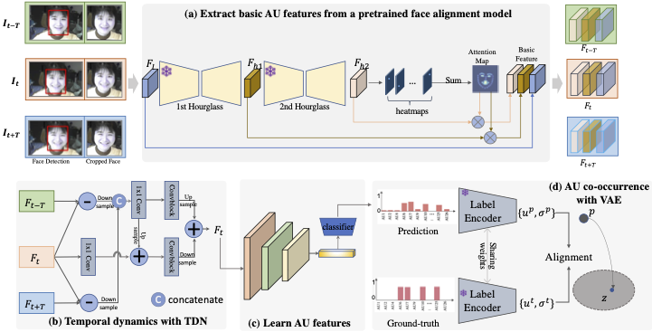

## Towards robust facial action units detection 
### Overview of AU-Net
[Paper](https://github.com/jingyang2017/AU-Net/blob/main/Towards%20Robust%20Facial%20Action%20Units%20Detection.pdf)
>A simple yet strong baseline for facial AU detection:
   * Extract basic AU features from a pretrained face alignment model
   * Instantiate [TDN](https://github.com/MCG-NJU/TDN) to model temporal dynamics on static AU features
   * Use VAE module to regulate the initial prediction
<p align="center">

</p>


### Requirements
- Python 3
- PyTorch

### Data and Data Prepareing Tools
We use [RetinaFace](https://github.com/deepinsight/insightface) to do face detection:
  * [BP4D](http://www.cs.binghamton.edu/~lijun/Research/3DFE/3DFE_Analysis.html)
  * [DISFA](http://mohammadmahoor.com/disfa-contact-form/)
  * [AffWild2](https://ieeexplore.ieee.org/abstract/document/9320201?casa_token=0-G0xpSdpZsAAAAA:yPNhXCLDE7UjDzhkJECRPFPGNQhhf5G1UHH0YjAbJC7WB7sqUFATWXhkYdSjXu0qsj6HSjXBgBQ)


### Training and Testing
- train the VAE module on BP4D split 1, run:
```
python train_vae.py --data BP4D --subset 1 --weight 0.3 
```

- train the AU-Net, run:
```
python train_video_vae.py --data BP4D --vae 'pretrained vae model'
```

- Pretrained models [Test](test.py)

|BP4D| Average F1-score(%)|
| :---: |  :---: |
|bp4d_split*|65.0|

|DISFA| Average F1-score(%)|
| :---: |  :---: |
|disfa_split*|66.1|

- Demo to predict 15 AUs [Demo](demo.ipynb)

## Citation
```
@article{yang2023toward,
  title={Toward Robust Facial Action Units’ Detection},
  author={Yang, Jing and Hristov, Yordan and Shen, Jie and Lin, Yiming and Pantic, Maja},
  journal={Proceedings of the IEEE},
  year={2023},
  publisher={IEEE}
}
```

### Acknowledgements
This repo is built using components from [JAANet](https://github.com/ZhiwenShao/PyTorch-JAANet) and [EmoNet](https://github.com/face-analysis/emonet)

### License
This project is licensed under the MIT License

